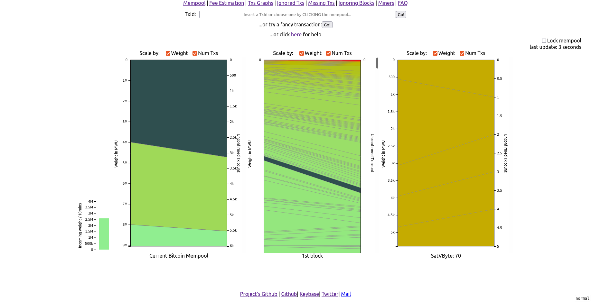

# Open Source Interactive Mempool Visualizer

This is the full mempool visualizer & explorer running on <https://mempoolexplorer.com>. It is focused on visualizing where a transaction is in the mining queue, but also offers data about transaction dependency graphs, ignored transactions, and miners profit statistics.



## Instalation

### Development (you have your own bitcoin node)

Mempool explorer can be self-hosted via docker-compose following the next steps:

1. Download the code via `git clone https://github.com/mempoolexplorer/mempoolexplorer.git`

2. You must have running a bitcoind node with this parameters enabled:
```
 - rpcallowip=172.18.0.2 
 - rpcuser=anon 
 - rpcpassword=anon
 - txindex=1
 - zmqpubsequence=tcp://[yourLocalIPHere]:29000
 - rpcbind=[yourLocalIPHere]
```

rpcallowip will be the ip of the docker container which asks for the mempool.
It is expected to have a bitcoind node with user/password=anon/anon if you want to use other change also in /devops/mempoolExplorerBack1Dev.yml

3. You must have the following environment variable:

 - `export BITCOIND_HOST_IP_ADDRESS="yourLocalIPHere"`

4. Execute script in `devops/buildAndUpAllDev.sh`, this will create the backend, frontend, and mongodb docker containers. Code will be compilled inside of the container and executed.

5. Check the initial mempool loading and syncronization using `devops/logBackEnd1.sh`, You have to search for "Node marked as synced." after "Querying data for txs... 100%" and "Comparing mempools size: bitcoind:XXX mempoolExplorerBackend:XXX" or just wait a little depending on the current size of the mempool.

6. If everything where OK, go to http://172.18.0.4:3001/ and enjoy, be aware that as this is executed locally, http is used instead of https.

7. You can consult the FAQ section in the webpage.

8. To stop everything, execute `devops/downAllDev.sh`

### Production (you haven't your own bitcoin node)

1. Download the code via `git clone https://github.com/mempoolexplorer/mempoolexplorer.git`

2. You must have a file here with your configuration: ~/.bitcoin/dockerbitcoin.conf (same contents as point 2 in development). By default, the blockchain will be downloaded in ~/.bitcoin

3. Execute script in `devops/buildAndUpAllProd.sh`, this will create the bitcoind node, backend, frontend, and mongodb docker containers. Code will be compilled inside of the container and executed.

4. Check bitcoin node status using `devops/logBitcoindNode.sh`. Check the initial mempool loading and syncronization using `devops/logBackEnd1.sh`, You have to search for "Node marked as synced." after "Querying data for txs... 100%" and "Comparing mempools size: bitcoind:XXX mempoolExplorerBackend:XXX" or just wait a little depending on the current size of the mempool.

5. If everything where OK, go to https://172.18.0.4 and enjoy, be aware that you have to configure your rsa certificates in your local ~/rsassl folder

6. You can consult the FAQ section in the webpage.

7. To stop everything, execute `devops/downAllProd.sh`

## Configuration

You can consult backend configuration [here](https://github.com/mempoolexplorer/mempoolexplorer/blob/main/back/README.md)

